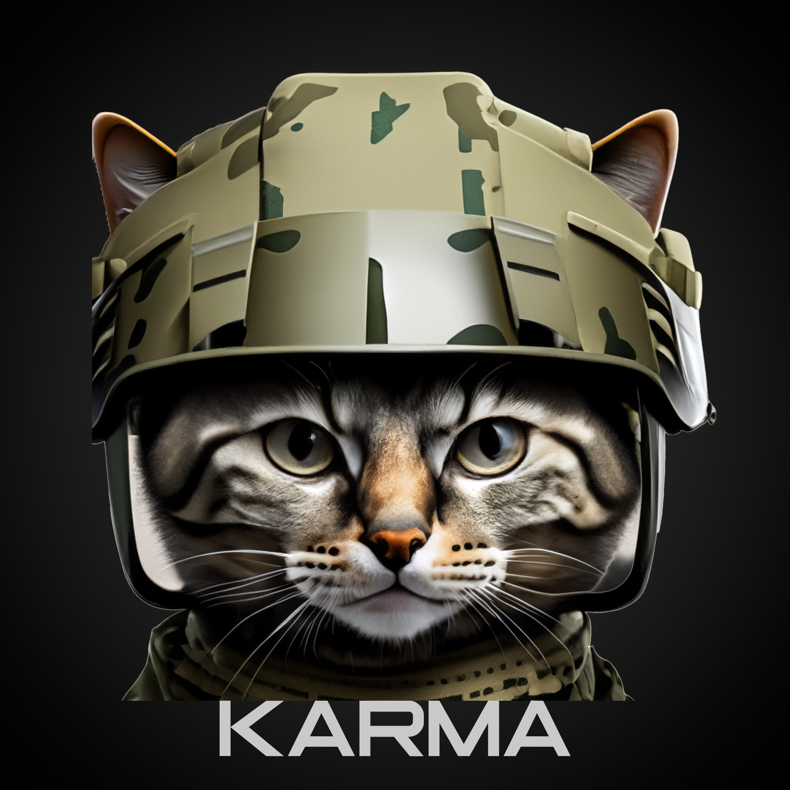

# 75th Ranger Regiment (Misfit)

“The 75th Ranger Regiment is the premier light infantry Special Operations Force comprised of specially selected and well-trained Soldiers that are lethal, agile, and flexible force that can conduct Joint Special Operations missions. Our capabilities include conducting airborne and air assaults, seizing airfields, destroying strategic targets, Security/Cordon for other SOF units and Direct Action (DA) Missions.”&#x20;

**“Rangers lead the way”**

***

<figure><figcaption></figcaption></figure>

### Unit Leadership



####  Karma

> Placeholder Text

Discord: Karma




#### Majestic44

> Placeholder Text

Discord: majestic44

Youtube: [https://www.youtube.com/@majestic44tv](https://www.youtube.com/@majestic44tv)



